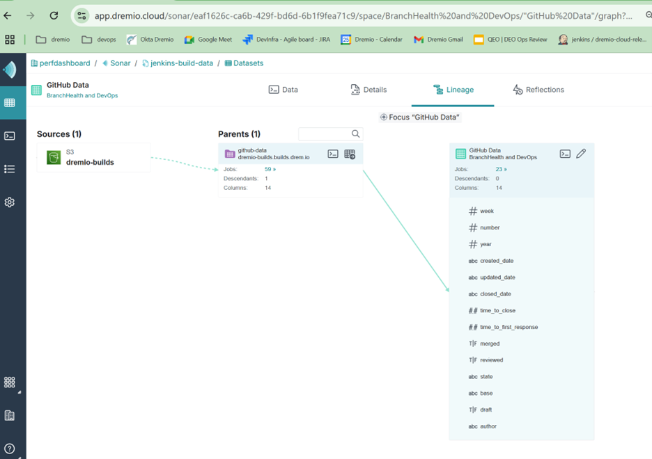
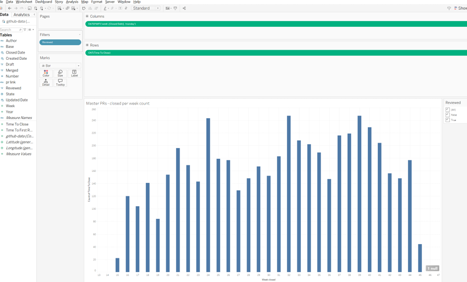
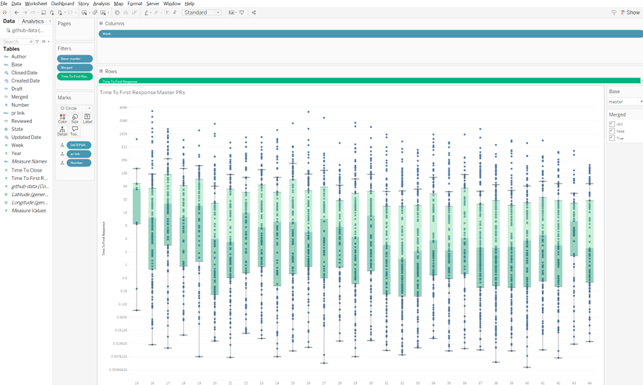
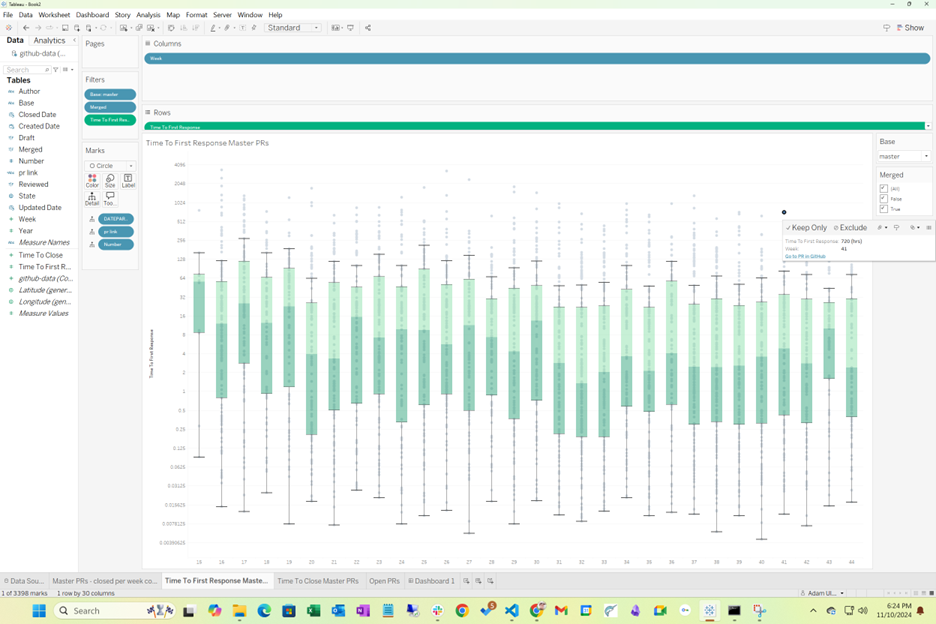
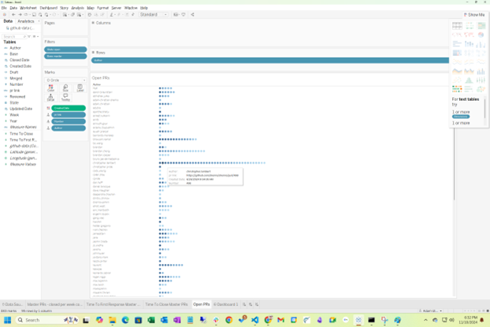
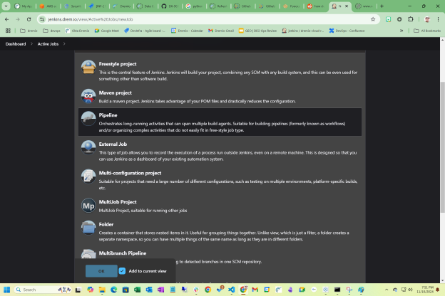

Dremio Pull Request Data Analysis

# Executive Summary

In my current role as an engineering director for Dremio developer experience, I've been asked to provide metrics specifically around friction encountered by developers at Dremio.

We define two workflows for developers; the dev inner loop and the dev outer loop.

- The dev inner loop consists of source code checkout, writing new code, testing that code locally, and build time on their local box to enable testing.
- The dev outer loop consists of the CI pipeline. This is pull request creation and approval, code review process, and automated testing.

In this case, I was looking specifically at the pull request creation and approval process. The questions I was asked to answer were:

- How long does it take for a pull request (PR) to go from creation to merged and closed?
- How long does it take for a PR to go from creation to first comment?
- How many PRs do we merge and close per week?
- How many PRs are still open and haven’t been touched in the last 90 days?

Finally, we don’t want a single snapshot. We need this to be updated regularly so that we can make process or technology changes based on the data.

# Tech Stack

Dremio uses the following technologies for development:

- Source Code Control: **GitHub**
- CI/CD automation: **Jenkins**
- Analytical Data Storage: **S3/GCP Buckets in parquet format**
- Data Lakehouse: **Dremio**
- Data Dashboards and Vizualizations: **Tableau**

# Solution Overview

1. Define the data needed from github to answer the questions above.
2. Identify github rest api endpoints that provide access to the data.
3. Retrieve the data from github and place in S3.
4. Use Dremio to index the data in s3.
5. Use Tableau to create a dashboard that answers the questions.
6. Build a Jenkins pipeline to automate updating the s3 bucket data.

# Step 1: Define the Data

We need the following datapoints to answer the above questions:  
    {

&nbsp;       "week": 19,

&nbsp;       "number": 851,

&nbsp;       "year": 2024,

&nbsp;       "created_date": "2024-05-11T01:22:26",

&nbsp;       "updated_date": "2024-05-15T17:42:17",

&nbsp;       "closed_date": "2024-05-15T17:42:17",

&nbsp;       "time_to_close": 112.33083333333333,

&nbsp;       "time_to_first_response": 71.07666666666667,

&nbsp;       "merged": true,

&nbsp;       "reviewed": true,

&nbsp;       "state": "closed",

&nbsp;       "base": "master",

&nbsp;       "draft": false,

&nbsp;       "author": "mmunguia-dremio"

&nbsp;   },

# Step 2: Identify APIs

Github documents many rest apis (<https://docs.github.com/en/rest?apiVersion=2022-11-28>).

Based on the data we need, we can gather a list of pull requests using this api:

<https://api.github.com/search/issues?q={query}>

query = 'repo:{username}/{repo} is:pr created:{date_range}'

However, this is not sufficient to identify the base or the time to first response. Two additional queries will get this data:

<https://api.github.com/repos/{username}/{repo}/pulls/{item\['number'\]}>

<https://api.github.com/repos/{username}/{repo}/issues/{item\['number'\]}>"

# Step 3: Retrieve the Data

I opted to implement the data retrieval in python. I ran into several GitHub issues that had to be solved.

## Problem 1: GitHub paginates data

Github will only return (by default) 30 results at a time. Within the api is a “next” value. When this exists, you need to iterate until there is no next, to gather all the data.

## Problem 2: GitHub returns a maximum of 900 rows in a single query

Asking for all the PR data in a single query won’t work. I decided to break it up request a single weeks worth of data at time, which is no more than 250. This mean looping through each week in the last year to get the entire years’ worth of data.

## Problem 3: GitHub rate limit

GitHub limits users of the API to a maximum of 5000 queries per hour. With 5500 PRs, and having to query twice for each PR, I was hitting this limit. The solution was to slow down and wait 1-2 minutes (time.sleep) in between collecting a weeks’ worth of data.

After these problems were solved, I ended up with a single 2.5mb json file formatted as list of dictionaries. Going to the AWS console, we created a new folder in an existing S3 bucket for GitHub data, and uploaded the file there.

## Step 4: Index the data in Dremio

Selecting the AWS S3 bucket in Dremio Cloud, and having Dremio format the json with iceberg parquet format, and the data can now be queried using the Dremio rest API or a Dremio connector.

## Step 5: Tableau Visualizations

### PRs Closed Per Week

### How long does it take for first comment on a PR? And time to close?

I opted to use a box and whiskers charts to show the mean, 25%, 75% and outliers. Note that tableau charts are interactive, and I included a link in the tooltip to take users directly to the GitHub PR to see more details.

### Open PRs

I created a stacked bar chart to show the open PRs for each developer. The tooltip and color shows the age of each PR.

## Step 6: Build a Jenkins pipeline to update the data

We used a query based on creation date to generate the initial data. But state on the data we pulled can be updated at any time, so we need to change our query to get all PRs updated in the last week.

### Problem 1: Updating the data

What became a real issue was updating existing data in the 3s bucket. The format we selected was a single file. We need to update datapoints within that file. We came up with 4 possible solutions.

- Bad solution. Create a single file per PR. This will lead to eventually hitting a limit of max files in a  Dremio bucket.
- Bad solution: re-read all the data again from GitHub, overwrite the file in S3. This process could take 2+ hours and will get longer by 5 minutes every week. Yuck
- OK solution. Read the data from Dremio, query GitHub for updates in the last week, update the data, and overwrite the file in S3. This is a 5 minute job each week.
- Good solution. Format the bucket as an Iceberg Table, and use the Dremio REST API to update rows in the table. The simplest solution after the initial data was loaded was to pull the last weeks creates and updates, delete those rows (if the exist), 
and then insert all the rows into the table. This required getting a PAT for access to Dremio, and learning the rest APIs.

### Jenkins Implementation

Setting up a Jenkins pipeline correctly means

- checking your code in to source control.
- adding code to push the data updates to S3.
- removing hardcoded credentials (s3 access and GitHub access) and placing them in Jenkins credential management.
- Setting a schedule for the pipeline to run.
- Adding alerts when the pipeline fails.

# Summary

We now have a solution that will update our s3 data bucket every week, and an interactive dashboard that should help answer where friction is in the PR code review process, as well as future questions in the Pull Request process.